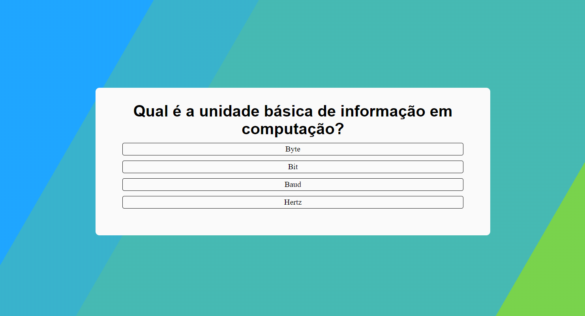

# Trivia game

Um jogo de trivia é um desafio de perguntas e respostas, onde os jogadores testam seu conhecimento em diversas categorias respondendo a perguntas. O objetivo é acumular pontos acertando o maior número de perguntas possível. Cada rodada tem 5 pesguntas

## 🔗 Links

Experimente: https://luminous-narwhal-a5848e.netlify.app/
